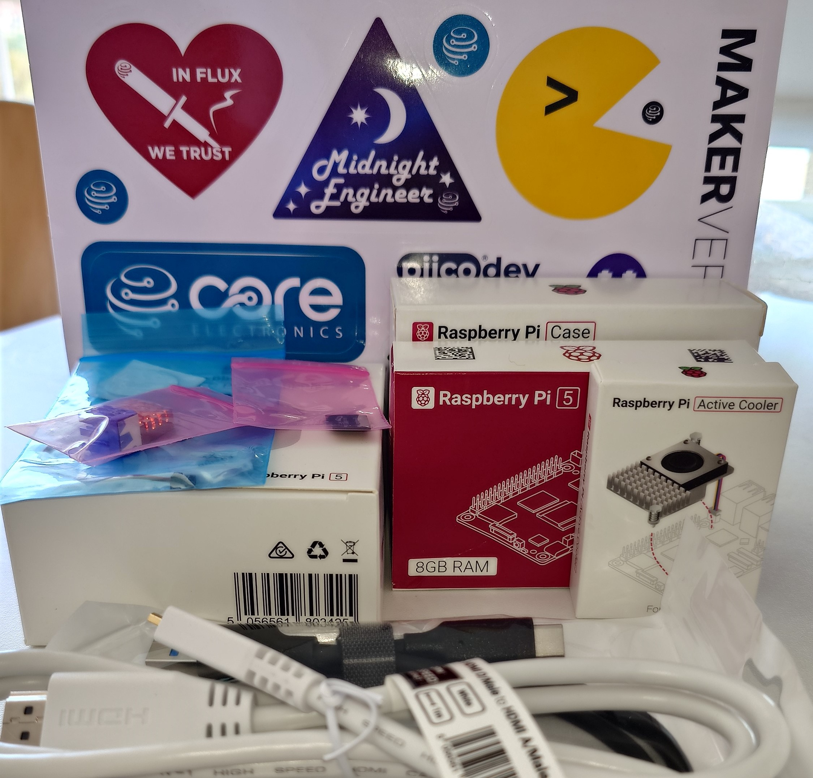

# The Process: Building Where The Hull Are You

A development journey blog documenting the creation of a boat tracking system.

# Phase 1: Creating Pipeline on Pi Device

## Entry 5: Depth Perception — Distance Estimation & Zone Analysis
*Date: March 14, 2026*

Implemented a full **depth perception module** using the OAK-D's built-in stereo cameras, giving the pipeline real-time distance readouts for every detected boat and a danger-zone overlay for obstacle awareness:

**StereoDepth Node Integration:**
- Wired CAM_B (left mono) and CAM_C (right mono) into the OAK-D's on-device `StereoDepth` node using the `DEFAULT` preset
- Depth frame is aligned to CAM_A (colour camera) so pixel coordinates match across streams
- Depth output queue plumbed alongside the existing video queues in `CameraAccess`

**New `depth_perception` Module:** 🥳🎉🎊
- `TargetEstimator` — combines a stereo depth frame with YOLO detection boxes to produce per-detection estimates:
  - **Distance** (metres) sampled from the inner 40% of each bounding box to reduce edge noise; invalid/out-of-range pixels are discarded
  - **Normalised bearing** from frame centre for each target
  - Structured `DetectionEstimate` output (track ID, confidence, distance, bearing, bbox)
- `DepthZoneAnalyser` — divides the depth frame into equal left / centre / right columns and classifies each as `"clear"`, `"danger"`, or `"unknown"` against a configurable threshold (default 2 m); placeholder for future rover avoidance integration

**Pipeline & Annotation Updates:**
- `TargetEstimator` instantiated as part of the `Pipeline` and runs per-frame when inference is enabled
- `CameraTracking.draw_detections()` updated to overlay distance labels (e.g. `3.2m`) on each bounding box in white with a black outline for contrast
- Inference correctly gated to the colour camera feed only (bug fix)

**Pipeline Refactor:**
- `_build_pipeline` split into focused helper methods (`_build_camera_nodes`, etc.) to improve readability and maintainability

Testing the depth perception with distance estimate annotation added to bounding box:

---

## Entry 4: Raspberry Pi Deployment & On-Device Recording
*Date: March 8, 2026*

Successfully deployed the **oakd-camera-tracking** package to Raspberry Pi and achieved first on-device video recording 😁:

**Physical Hardware Setup:**
- Assembled Raspberry Pi 5 with OAK-D camera connection
- Configured headless operation for field deployment
- Set up power management and storage (SD card/external drive)

**Package Deployment:**
- Created installable package via `pyproject.toml` for Pi-specific deployment
- Transferred `oakd-camera-tracking` codebase to Pi device
- Installed dependencies and configured environment on ARM architecture
- Successfully ran pipeline and recorded video streams directly to Pi storage

**Pi-Specific Optimizations:**
- Implemented display detection for headless vs. desktop operation
  - Detects when no display is attached; if `live_view_enabled` is true, raises a configuration error and requires disabling live view or attaching a display
  - Enables live preview when display available for debugging
- Reduced color camera resolution to optimize bandwidth on Pi hardware
- Enhanced logging output for remote debugging and monitoring

**Documentation Updates:**
- Added Pi-specific installation instructions to README
- Documented file transfer methods (rsync, SCP)
- Included nano editor tips for config editing on device

**Key Achievements:**
- First successful video capture from OAK-D camera directly on Pi
- Validated portability of config-driven architecture

Parts arrival:

Testing the pipeline and camera recording from the Pi device:

Saved CAM_A, CAM_B, CAM_C and gyro data files:

---

# Phase 0: Creating Pipeline on Local Device

## Entry 3: Multi-Camera Recording & Code Refactoring
*Date: March 4, 2026*

Extended pipeline to support **all three OAK-D cameras** (RGB + left/right mono) with intelligent auto-detection:

**Multi-Camera Functionality:**
- Simultaneous recording from all three camera sensors (RGB, left mono, right mono)
- Separate video files for each camera stream with synchronized timestamps

**Auto-Detection Features:**
- Automatic camera discovery:
    - Auto-resolution detection
    - Auto-type detection and recording handling. MONO vs COLOUR.

**Code Quality Improvements:**
- Refactored `pipeline.py` initialization with dedicated methods for clarity
- Implemented lazy recorder and gyro recorder startup functions
- Standardized camera socket key naming conventions

**Technical Details:**
- Reduced all cameras to mono framerate to prevent sync issues
- VideoWriter automatically configures based on detected camera type

Pipeline now supports comprehensive multi-angle recording for 3D reconstruction and depth perception work ahead.

## Entry 2: DepthAI V3 Migration & Gyroscope Integration
*Date: February 27, 2026*

Successfully migrated the camera pipeline to **DepthAI V3 API** and integrated gyroscope data recording:

**DepthAI V3 API Updates:**
- Migrated from `ColorCamera` node to new `Camera` node with `.build()` pattern
- Updated camera resolution to 1280x720 with increased output queue (16 frames)
- Fixed IMU sensor initialization to use list syntax: `enableIMUSensor([dai.IMUSensor.GYROSCOPE_RAW], 100)`
- Debugged device connection lifecycle and resource management

**Gyroscope Data Recording:**
- Implemented `GyroRecorder` class for timestamped gyroscope data logging
- Records gyro readings to JSONL format alongside video recordings
- Integrated IMU data capture with main pipeline loop
- Added `record_gyroscope` config toggle for optional gyro recording

**Key Learnings:**
- OAK-D IMU (BMI270) requires proper API syntax for sensor enablement
- V3 API breaking changes required careful queue management refactoring
- Device connection errors traced to Jupyter notebook sessions holding camera locks
- Queue configuration (batch thresholds, max reports) critical for real-time data flow

Pipeline now successfully captures synchronized video and gyroscope data streams when `record_gyroscope: True` in config.

Images of testing the video stream from the camera on my **local** device when running the pipeline from the command line, and testing the gyro data capture.

## Entry 1: Core Pipeline Architecture Implementation
*Date: February 23, 2026*

Built the complete pipeline for OAK-D camera, YOLO inference, tracking, and video recording:

- Camera access with optional gyroscope data capture
- Video recording with timestamps
- YOLO inference with multi-frame tracking support
- Config-driven feature toggling (inference, tracking, recording, live view)
- Command-line entry point (`run_pipeline.py`)

**Raspberry Pi Portability Built In:**
- All device-specific settings (output paths, FPS, resolution) are config-driven
- No hardcoded paths—everything resolves relative to project root
- Modular class structure with clear separation (camera, inference, recording, tracking)
- DepthAI and ultralytics both run on Raspberry Pi without code changes
- Settings validation ensures configs are correct before pipeline starts

When Raspberry Pi parts arrive, deployment is simply: copy code to Pi, update config values for device/storage paths, and run `run_pipeline.py`.

---
